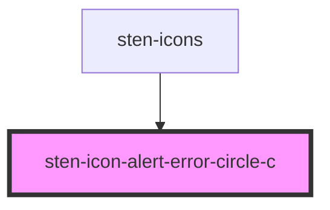

# sten-icon-alert-error-circle-c

<!-- Auto Generated Below -->

## Properties

| Property     | Attribute     | Description     | Type               | Default     |
| ------------ | ------------- | --------------- | ------------------ | ----------- |
| `classNames` | `class-names` | 传入的class名称      | `string`           | `undefined` |
| `color`      | `color`       | 图标颜色            | `string`           | `undefined` |
| `rotate`     | `rotate`      | 旋转的角度           | `number`           | `undefined` |
| `size`       | `size`        | icon 尺寸 默认 20   | `number \| string` | `20`        |
| `spin`       | `spin`        | 是否自动旋转          | `boolean`          | `undefined` |
| `styles`     | --            | styles 传入的css样式 | `object`           | `undefined` |

## Dependencies

### Used by

 - [sten-icons](../sten-icons)

### Graph

----------------------------------------------

*Built with [StencilJS](https://stenciljs.com/)*
